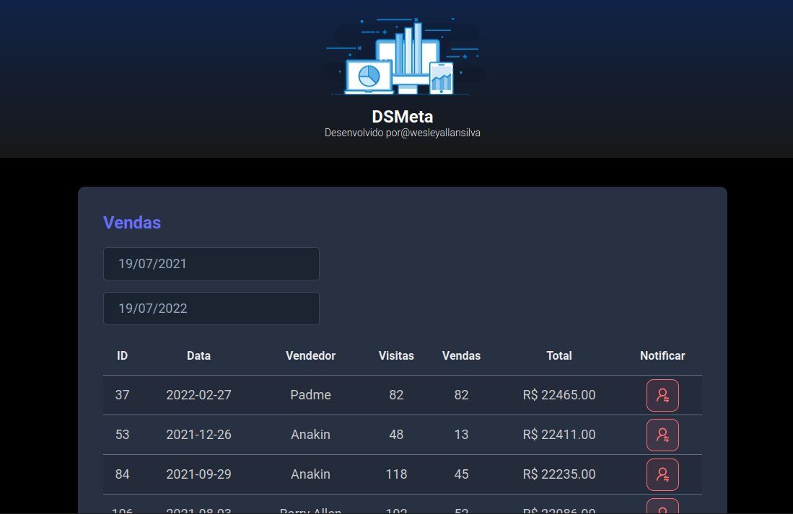

# Projeto DSMETA

Projeto desenvolvido no evento "Semana Spring React"  realizado pela DevSuperior 

# Tecnologias utilizadas:
- Frontend:
  - React
- Backend
  - Bando de Dados H2
  - Spring (Java)
